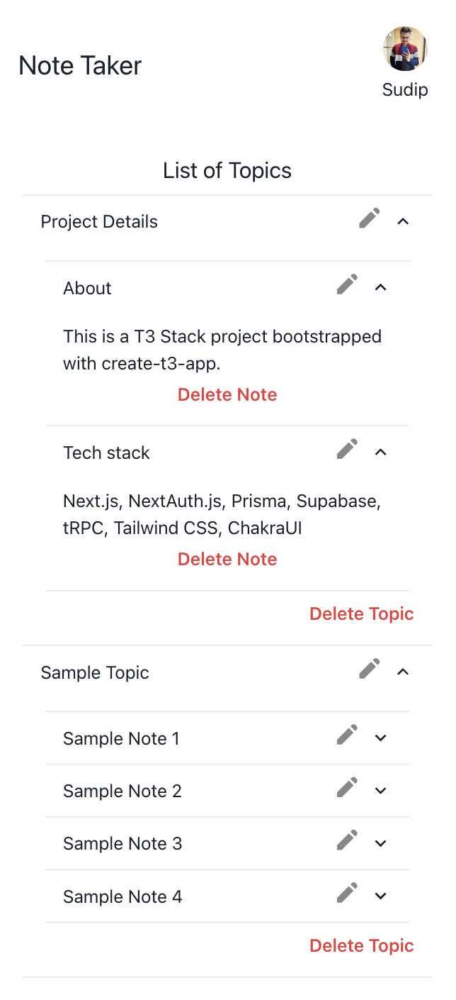
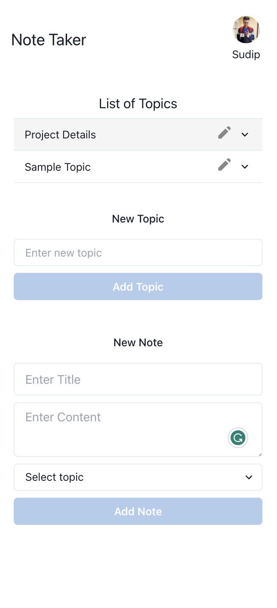

# Note Taking App

This is a [T3 Stack](https://create.t3.gg/) project bootstrapped with `create-t3-app`.

- [Next.js](https://nextjs.org)
- [NextAuth.js](https://next-auth.js.org)
- [Prisma](https://prisma.io)
- [Supabase](https://supabase.com/)
- [tRPC](https://trpc.io)
- [Tailwind CSS](https://tailwindcss.com)
- [ChakraUI](https://chakra-ui.com/)

# Project Showcase

    
    

